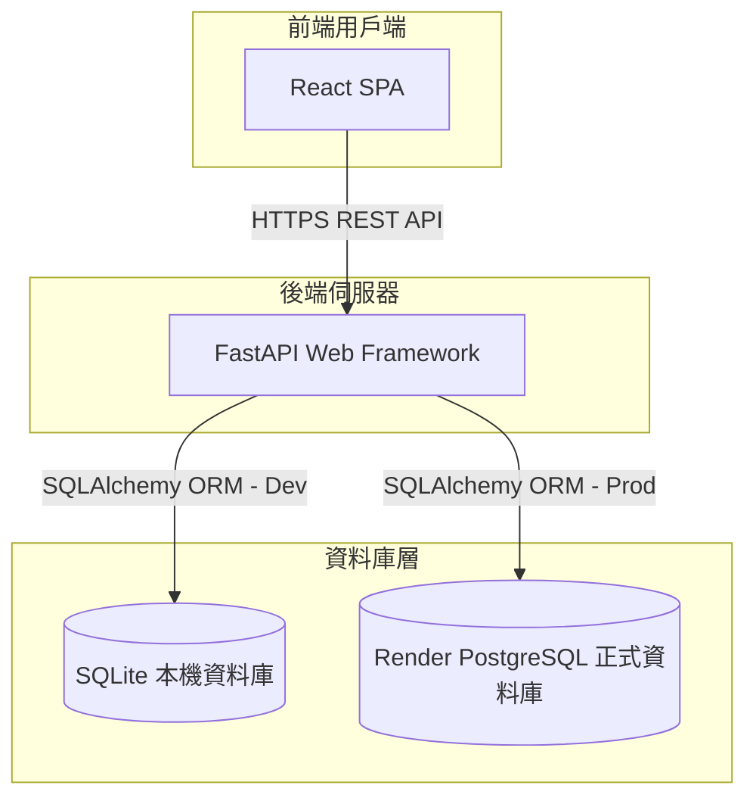
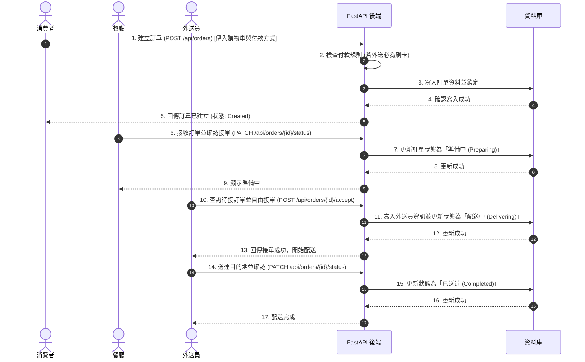

# 餐廳外送系統 - 系統架構設計文件 (System Architecture Design Document)

## 1. 系統架構 (System Architecture)
本系統採用前後端分離架構，前端為 React 單頁應用程式 (SPA)，後端為基於 Python FastAPI 構建的 RESTful API 服務。本地開發使用輕量級 SQLite 資料庫，正式環境部署於 Render.com 並搭配 Render PostgreSQL 資料庫。

## 2. 核心模組職責 (Core Module Responsibilities)

*   **使用者模組 (User Module)**
    *   負責使用者註冊、登入與身份驗證（使用 JWT Token）。
    *   管理消費者 (Consumer)、餐廳 (Restaurant)、外送員 (Delivery Agent) 及管理者 (Admin) 等角色權限。
*   **餐廳模組 (Restaurant Module)**
    *   提供餐廳基本資料與營業狀態的設定。
    *   管理者可管理並審查餐廳帳戶與權限。
    *   提供管理者查看各餐廳營收統計的分析邏輯。
*   **菜單模組 (Menu Module)**
    *   支援餐廳進行餐點分類（Category）管理。
    *   支援餐廳餐點（Meal）的上架、下架、編輯名稱、價格與描述。
*   **購物車模組 (Shopping Cart Module)**
    *   負責處理消費者選擇餐點、變更數量與小計。
    *   考量效能與體驗，購物車資料可先於前端進行暫存與計算，送出訂單時再由後端進行校驗。
*   **訂單模組 (Order Module)**
    *   驗證消費者購物車明細及庫存狀態。
    *   驗證付款規則（到店自取可現金或刷卡，外送服務僅限刷卡）。
    *   建立訂單主檔與明細檔，扣除商品可用存量，並處理結帳金額計算。
*   **訂單狀態模組 (Order Status Module)**
    *   定義與維護訂單生命週期狀態機。
    *   限制各角色對於訂單狀態的變更權限（例如：外送員僅能更新外送狀態，餐廳僅能更新準備狀態）。

## 3. 資料流 (Data Flow)
以**消費者下單 -> 餐廳接單 -> 外送員配送**的主流程為例：

## 4. 資料庫設計建議 (Database Design Recommendations)
欄位關係建議如下：
*   `users`：儲存帳戶資訊（ID, 帳號, 信箱, 密碼雜湊, 角色角色）。
*   `restaurants`：餐廳基本資料（ID, 負責人ID [FK `users.id`], 名稱, 狀態）。
*   `categories`：餐點分類（ID, 餐廳ID [FK `restaurants.id`], 名稱, 排序）。
*   `meals`：餐點資料（ID, 分類ID [FK `categories.id`], 名稱, 價格, 是否上架）。
*   `orders`：訂單主檔（ID, 消費者ID [FK `users.id`], 餐廳ID [FK `restaurants.id`], 外送員ID [FK `users.id`, Nullable], 總金額, 付款方式 [Cash/Card], 狀態 [Created/Preparing/Delivering/Completed/Cancelled]）。
*   `order_items`：訂單明細（ID, 訂單ID [FK `orders.id`], 餐點ID [FK `meals.id`], 購買時單價, 數量）。
*   `order_status_logs`：訂單狀態歷史軌跡（ID, 訂單ID [FK `orders.id`], 變更前狀態, 變更後狀態, 變更者ID [FK `users.id`], 時間）。

## 5. API 設計建議 (API Design Recommendations)
*   **認證相關**
    *   `POST /api/auth/register` (註冊帳戶)
    *   `POST /api/auth/login` (登入並獲取 JWT Token)
*   **餐廳與菜單**
    *   `GET /api/restaurants` (消費者瀏覽餐廳列表)
    *   `GET /api/restaurants/{id}/menu` (消費者/餐廳瀏覽菜單)
    *   `POST /api/restaurants/{id}/meals` (餐廳餐點上架)
    *   `PUT/DELETE /api/meals/{meal_id}` (餐廳餐點編輯/下架)
*   **訂單管理**
    *   `POST /api/orders` (消費者送出訂單)
    *   `GET /api/orders` (多角色訂單列表，按權限與角色過濾)
    *   `PATCH /api/orders/{id}/status` (餐廳/外送員/消費者更新訂單狀態)
    *   `GET /api/orders/available` (外送員查詢目前可承接之外送訂單)
*   **管理後台**
    *   `GET /api/admin/revenue` (管理者查詢各餐廳營收統計)
    *   `GET /api/admin/accounts` (管理者管理使用者帳戶)

## 6. 技術選型 (Tech Stack)
*   **前端**：React SPA + Tailwind CSS + Axios
*   **後端**：FastAPI + SQLAlchemy ORM + Pydantic (資料驗證) + Alembic (資料庫遷移管理)
*   **資料庫**：SQLite (開發) / PostgreSQL (正式)
*   **部署**：Render Web Service (後端與前端靜態託管) + Render Managed PostgreSQL

## 7. 安全性 (Security)
*   **密碼安全**：採用 bcrypt 進行密碼雜湊加密儲存。
*   **API 安全**：使用 JWT 進行身份驗證，並在 Request Headers 攜帶 Token；API 端點設有 Role-based 權限限制。
*   **機密資訊管理**：禁止將資料庫連線字串、JWT Secret 提交至 Git。必須以環境變數進行動態配置，並提供 `.env.example`。

## 8. 部署方式 (Deployment Methods)
*   前後端均部署於 Render.com：
    *   前端：可選用 Render Static Site 託管 React 建置後的靜態檔案。
    *   後端：以 Python 運作環境部署 FastAPI 服務，並配置外部環境變數連接 Render PostgreSQL。

## 9. 待確認事項 (Pending Issues)
*   線上信用卡交易模擬（是否串接模擬金流沙盒如 ECPay 或僅在後端做狀態模擬）。
*   外送員的地理位置追蹤（是否需要在地圖上即時顯示，或僅在訂單更新狀態時通知）。
*   取消訂單的時機點限制（例如：餐廳已開始準備後，消費者是否能取消訂單）。
