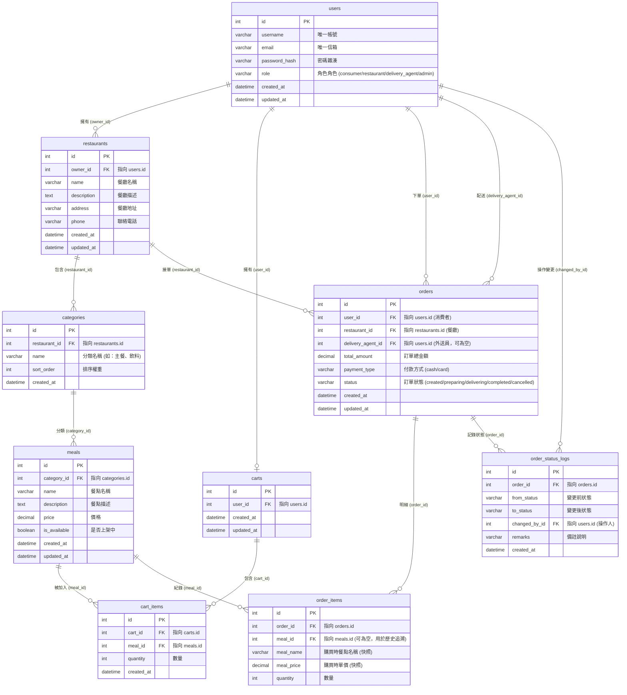

# 餐廳外送系統 - 資料模型設計文件 (Data Model Design Document)

## 1. 實體關聯圖 (Entity Relationship Diagram - ERD)
以下使用 Mermaid 呈現系統內各表結構與關聯關係：

## 2. 核心實體說明 (Core Entities)
*   **users (使用者表)**：儲存系統中所有註冊人員的基本帳號資訊，以 `role` 欄位區分消費者、餐廳負責人、外送員與管理者。
*   **restaurants (餐廳表)**：儲存餐廳基本營業資料，每家餐廳皆綁定一名使用者帳號（`owner_id`）作為負責人。
*   **categories (餐點分類表)**：餐廳內的菜單分類，例如「主廚推薦」、「冷飲」等。
*   **meals (餐點表)**：各分類下的具體餐點明細，記錄價格與上下架狀態。
*   **carts (購物車表)**：消費者的購物車，與使用者成 1 對 1 關係。
*   **cart_items (購物車項目表)**：儲存購物車內加入的具體餐點與數量。
*   **orders (訂單表)**：記錄交易的訂單主檔，包含總金額、付款方式與目前配送進度。
*   **order_items (訂單明細快照表)**：紀錄訂單建立時的餐點快照（名稱與單價），避免日後餐廳修改菜單影響歷史交易紀錄。
*   **order_status_logs (訂單狀態歷史紀錄表)**：用於記錄訂單在生命週期中的每一次狀態變更，提供完整的審計追蹤路徑。

## 3. 實體欄位與資料型別 (Entity Fields & Data Types)

### 3.1 users
| 欄位名稱 | 資料型別 (SQL 建議) | 鍵值類型 | 允許空值 | 說明 / 預設值 |
|---|---|---|---|---|
| id | INT | PK | No | 自動遞增 ID |
| username | VARCHAR(50) | Unique | No | 登入帳號 |
| email | VARCHAR(100) | Unique | No | 電子郵件信箱 |
| password_hash | VARCHAR(255) | - | No | 密碼雜湊值 (bcrypt) |
| role | VARCHAR(20) | - | No | 角色 (consumer/restaurant/delivery_agent/admin) |
| created_at | TIMESTAMP | - | No | 建立時間 (DEFAULT CURRENT_TIMESTAMP) |
| updated_at | TIMESTAMP | - | No | 修改時間 (DEFAULT CURRENT_TIMESTAMP) |

### 3.2 restaurants
| 欄位名稱 | 資料型別 (SQL 建議) | 鍵值類型 | 允許空值 | 說明 / 預設值 |
|---|---|---|---|---|
| id | INT | PK | No | 自動遞增 ID |
| owner_id | INT | FK | No | 負責人 ID，參照 `users(id)` |
| name | VARCHAR(100) | - | No | 餐廳名稱 |
| description | TEXT | - | Yes | 餐廳簡介 |
| address | VARCHAR(255) | - | No | 餐廳地址 |
| phone | VARCHAR(20) | - | No | 聯絡電話 |
| created_at | TIMESTAMP | - | No | 建立時間 |
| updated_at | TIMESTAMP | - | No | 修改時間 |

### 3.3 categories
| 欄位名稱 | 資料型別 (SQL 建議) | 鍵值類型 | 允許空值 | 說明 / 預設值 |
|---|---|---|---|---|
| id | INT | PK | No | 自動遞增 ID |
| restaurant_id | INT | FK | No | 餐廳 ID，參照 `restaurants(id)` |
| name | VARCHAR(50) | - | No | 分類名稱 |
| sort_order | INT | - | No | 排序權重 (預設 0) |
| created_at | TIMESTAMP | - | No | 建立時間 |

### 3.4 meals
| 欄位名稱 | 資料型別 (SQL 建議) | 鍵值類型 | 允許空值 | 說明 / 預設值 |
|---|---|---|---|---|
| id | INT | PK | No | 自動遞增 ID |
| category_id | INT | FK | No | 分類 ID，參照 `categories(id)` |
| name | VARCHAR(100) | - | No | 餐點名稱 |
| description | TEXT | - | Yes | 餐點描述 |
| price | DECIMAL(10, 2) | - | No | 單價 |
| is_available | BOOLEAN | - | No | 是否上架 (預設 TRUE) |
| created_at | TIMESTAMP | - | No | 建立時間 |
| updated_at | TIMESTAMP | - | No | 修改時間 |

### 3.5 carts
| 欄位名稱 | 資料型別 (SQL 建議) | 鍵值類型 | 允許空值 | 說明 / 預設值 |
|---|---|---|---|---|
| id | INT | PK | No | 自動遞增 ID |
| user_id | INT | FK (Unique) | No | 使用者 ID，參照 `users(id)` |
| created_at | TIMESTAMP | - | No | 建立時間 |
| updated_at | TIMESTAMP | - | No | 修改時間 |

### 3.6 cart_items
| 欄位名稱 | 資料型別 (SQL 建議) | 鍵值類型 | 允許空值 | 說明 / 預設值 |
|---|---|---|---|---|
| id | INT | PK | No | 自動遞增 ID |
| cart_id | INT | FK | No | 購物車 ID，參照 `carts(id)`，設定串聯刪除 (ON DELETE CASCADE) |
| meal_id | INT | FK | No | 餐點 ID，參照 `meals(id)` |
| quantity | INT | - | No | 數量，必須大於 0 |
| created_at | TIMESTAMP | - | No | 加入時間 |

### 3.7 orders
| 欄位名稱 | 資料型別 (SQL 建議) | 鍵值類型 | 允許空值 | 說明 / 預設值 |
|---|---|---|---|---|
| id | INT | PK | No | 自動遞增 ID |
| user_id | INT | FK | No | 下單消費者 ID，參照 `users(id)` |
| restaurant_id | INT | FK | No | 餐廳 ID，參照 `restaurants(id)` |
| delivery_agent_id | INT | FK | Yes | 承接外送員 ID，參照 `users(id)` |
| total_amount | DECIMAL(10, 2) | - | No | 訂單總金額 |
| payment_type | VARCHAR(20) | - | No | 付款方式 (cash: 現金, card: 刷卡) |
| status | VARCHAR(20) | - | No | 狀態 (created/preparing/delivering/completed/cancelled) |
| created_at | TIMESTAMP | - | No | 建立時間 |
| updated_at | TIMESTAMP | - | No | 修改時間 |

### 3.8 order_items
| 欄位名稱 | 資料型別 (SQL 建議) | 鍵值類型 | 允許空值 | 說明 / 預設值 |
|---|---|---|---|---|
| id | INT | PK | No | 自動遞增 ID |
| order_id | INT | FK | No | 訂單 ID，參照 `orders(id)`，設定串聯刪除 |
| meal_id | INT | FK | Yes | 餐點 ID，參照 `meals(id)` (餐點被物理刪除時設為 NULL，防範資料庫錯誤) |
| meal_name | VARCHAR(100) | - | No | 下單時餐點名稱 (快照) |
| meal_price | DECIMAL(10, 2) | - | No | 下單時單價 (快照) |
| quantity | INT | - | No | 數量 |

### 3.9 order_status_logs
| 欄位名稱 | 資料型別 (SQL 建議) | 鍵值類型 | 允許空值 | 說明 / 預設值 |
|---|---|---|---|---|
| id | INT | PK | No | 自動遞增 ID |
| order_id | INT | FK | No | 訂單 ID，參照 `orders(id)`，設定串聯刪除 |
| from_status | VARCHAR(20) | - | No | 變更前狀態 |
| to_status | VARCHAR(20) | - | No | 變更後狀態 |
| changed_by_id | INT | FK | No | 變更操作人 ID，參照 `users(id)` |
| remarks | VARCHAR(255) | - | Yes | 備註 (例如：外送員確認送達、消費者手動取消) |
| created_at | TIMESTAMP | - | No | 建立時間 |

## 4. 主鍵與外鍵限制 (Primary & Foreign Keys)
*   **串聯約束規則 (Cascading Rules)**:
    *   當購物車被刪除時，其所屬的 `cart_items` 應自動被刪除 (`ON DELETE CASCADE`)。
    *   當餐點 `meals` 遭刪除時，由於需要保存歷史訂單分析，`order_items` 的 `meal_id` 應設定為 `ON DELETE SET NULL`，藉此利用快照欄位 `meal_name` 與 `meal_price` 維持業務完整性。
    *   使用者刪除帳戶時，不應直接刪除其已完成之訂單，故 `orders.user_id` 與 `orders.delivery_agent_id` 應設為 `ON DELETE RESTRICT` 或 `SET NULL`。

## 5. 資料驗證規則 (Data Validation Rules)
*   **Email 格式**：`users.email` 須符合標準 Email 正規表示式，且在寫入時統一轉為小寫存入。
*   **密碼複雜度**：註冊時檢查密碼長度須大於等於 8 個字元。
*   **數值限制**：`meals.price`、`orders.total_amount`、`order_items.meal_price` 必須為大於 0 的數值。
*   **數量限制**：`cart_items.quantity` 與 `order_items.quantity` 必須大於等於 1。
*   **列舉值約束 (Enum Checks)**：
    *   `users.role` 限於：`['consumer', 'restaurant', 'delivery_agent', 'admin']`
    *   `orders.payment_type` 限於：`['cash', 'card']`
    *   `orders.status` 限於：`['created', 'preparing', 'delivering', 'completed', 'cancelled']`

## 6. 索引建議 (Index Recommendations)
為了提升高併發查詢時的效能，建議在以下外鍵及高頻檢索欄位上建立索引：
*   `CREATE INDEX idx_users_role ON users(role);` (依角色檢索帳戶)
*   `CREATE INDEX idx_meals_category_id ON meals(category_id);` (加載菜單餐點列表)
*   `CREATE INDEX idx_orders_user_id ON orders(user_id);` (消費者查詢歷史訂單)
*   `CREATE INDEX idx_orders_restaurant_id ON orders(restaurant_id);` (餐廳查詢接單歷史)
*   `CREATE INDEX idx_orders_status ON orders(status);` (外送員檢索待接訂單，或系統查詢目前處理中訂單)
*   `CREATE INDEX idx_order_items_order_id ON order_items(order_id);` (加載訂單詳細明細)

## 7. 資料生命週期 (Data Lifecycle)
*   **購物車項目失效**：購物車項目在加入超過 7 天未結帳時，應由排程作業（Cron Job）自動清除以減輕資料庫負擔。
*   **歷史訂單歸檔**：已完成（Completed）或已取消（Cancelled）超過 180 天的訂單，可考慮定期歸檔至歷史儲存庫，僅於有稽核需求時提供讀取。

## 8. 敏感資料處理方式 (Sensitive Data Handling)
*   **密碼處理**：使用者註冊或變更密碼時，後端必須使用 `bcrypt` 對密碼進行單向雜湊加密（Salt + Hash），再寫入 `users.password_hash`，嚴禁明文儲存。
*   **個資保護 (PII)**：使用者的聯絡電話、地址以及信箱於正式環境傳輸時，應使用 HTTPS 傳輸協定進行在途加密。前端呈現訂單時，應遮蔽部分電話（如：`0912***456`）以保護個資。
*   **支付機密**：系統不儲存任何信用卡卡號或安全碼。信用卡交易應完全交由第三方模擬金流平台處理，僅儲存金流平台回傳的交易授權碼 (Transaction Token)。

## 9. 待確認事項 (Pending Issues - 待確認事項)
*   **購物車暫存規則**：購物車是否需要持久化在資料庫？如果消費者未登入是否能使用購物車（需不需要支援前端 LocalStorage 暫存，登入後再與資料庫 `carts` 合併）？
*   **實體刪除 vs. 軟刪除 (Soft Delete)**：餐廳與餐點遭刪除時，是採用物理刪除還是改用 `is_deleted` 的軟刪除旗標？目前的欄位快照機制已部分規避此問題，但餐廳的狀態可能仍需進一步定義。
*   **外送員自由接單併發問題**：如何防範多個外送員在極短時間內同時承接同一筆訂單的競爭情況（Race Condition）？（後端是否需使用資料庫行鎖 `SELECT FOR UPDATE` 或 Redis 分散式鎖）。
