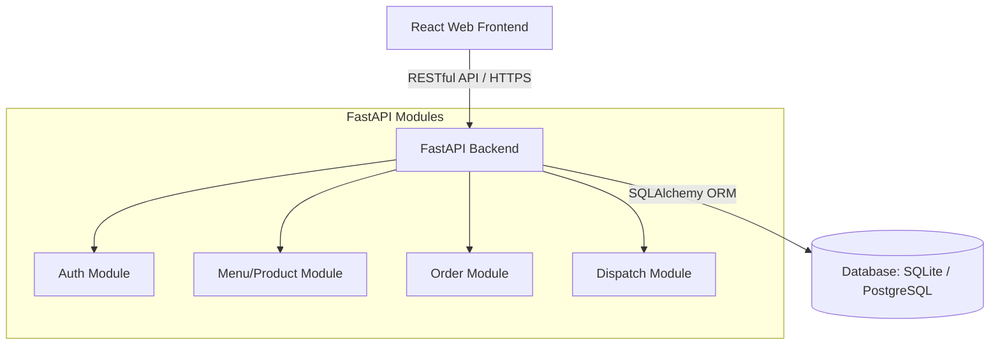
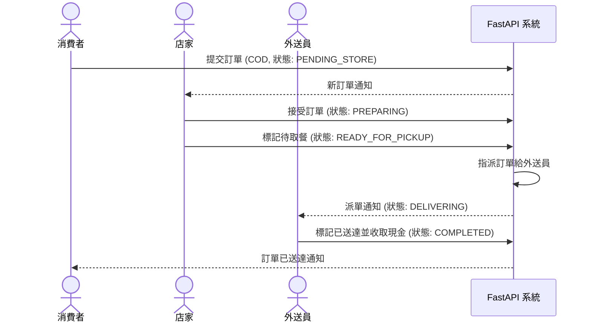

# System Architecture Design - 外送系統 (Delivery System)

## 1. System Architecture Diagram
本系統採用前後端分離架構。前端為 React 單頁應用程式 (SPA)，透過 RESTful API 與 FastAPI 後端伺服器進行通訊。後端則使用 SQLAlchemy ORM 存取資料庫（本地開發使用 SQLite，生產環境使用 Render PostgreSQL）。

---

## 2. Core Module Responsibilities
- **用戶認證模組 (Auth Module)**：
  - 負責消費者、店家與外送員的註冊與登入。
  - 使用 JWT (JSON Web Token) 進行身分驗證，並依角色 (Role) 實施權限控管。
- **菜單管理模組 (Menu/Product Module)**：
  - 店家端：管理自家的商品（新增、編輯、刪除、上架/下架商品）。
  - 消費者端：瀏覽店家列表與菜單內容。
- **訂單管理模組 (Order Module)**：
  - 消費者端：管理購物車、提交訂單（設定為貨到付款）。
  - 店家端：接收新訂單通知、變更訂單狀態（準備中、製作完成/待取餐）。
- **派單與配送模組 (Dispatch Module)**：
  - 系統/平台端：自動指派待取餐訂單給空閒且空閒時間最長的外送員。
  - 外送員端：變更訂單配送狀態（開始配送、已送達/完成並收取現金）。

---

## 3. Data Flow Diagram

### 點餐至送達核心業務流程

---

## 4. Database Design Recommendations
- **資料庫選型**：採用關聯式資料庫（本地為 SQLite，正式環境為 PostgreSQL），能有效確保訂單、商品與使用者之間的外鍵約束與事務完整性 (ACID)。
- **核心實體表設計簡述**（詳細 Schema 請見 `data-model.md`）：
  - `users` (用戶表)：儲存身分 credentials 與角色 (Consumer, Merchant, Driver)。
  - `merchants` (店家詳情表)：關聯 `users`，儲存店家名稱、介紹等。
  - `products` (餐點商品表)：關聯 `merchants`，儲存餐點名稱、售價、狀態。
  - `orders` (訂單主表)：儲存買賣雙方及外送員 ID、訂單狀態 (Status)、總金額。
  - `order_items` (訂單餐點明細表)：儲存該筆訂單所點餐點、數量與當時單價。

---

## 5. API Design Recommendations

### 5.1 用戶與認證 API
- `POST /api/auth/register` (註冊帳號：需指定角色)
- `POST /api/auth/login` (登入：回傳 JWT token 與用戶角色)

### 5.2 商家與菜單 API
- `GET /api/merchants` (消費者：瀏覽所有店家)
- `GET /api/merchants/{id}/menu` (消費者：瀏覽該店家菜單)
- `POST /api/merchants/products` (店家：新增餐點商品)
- `PUT /api/merchants/products/{id}` (店家：更新餐點商品)
- `DELETE /api/merchants/products/{id}` (店家：刪除商品)

### 5.3 訂單與配送 API
- `POST /api/orders` (消費者：建立新訂單，預設狀態 `PENDING_STORE`)
- `GET /api/orders` (所有角色：查詢與自己相關的訂單列表)
- `POST /api/orders/{id}/accept` (店家：接受訂單，狀態改為 `PREPARING`)
- `POST /api/orders/{id}/ready` (店家：餐點完成，狀態改為 `READY_FOR_PICKUP`)
- `POST /api/orders/{id}/assign` (系統/管理員：指派外送員，狀態改為 `DELIVERING`)
- `POST /api/orders/{id}/complete` (外送員：標記送達並收取現金，狀態改為 `COMPLETED`)

---

## 6. Tech Stack Selection
- **Frontend (前端)**: React (SPA, 使用 Vite 建置)、Tailwind CSS 或 CSS Module、Axios (API 請求)。
- **Backend (後端)**: FastAPI、Uvicorn (ASGI 伺服器)、Pydantic (資料驗證)、SQLAlchemy (ORM 框架)。
- **Database (資料庫)**: SQLite (本地)、Render PostgreSQL (生產環境)、Alembic (資料庫遷移管理)。
- **Hosting/Cloud (部署)**: Render.com (部署 FastAPI 後端與託管 React 前端靜態頁面)。

---

## 7. Security Considerations
- **身分驗證**: 採用 JWT Token 驗證，並在 FastAPI 中以 `Depends` 注入 Current User 權限檢查（例如：店家無法調用外送員的完成訂單 API）。
- **敏感資料防護**: 密碼使用 Bcrypt / Argon2 雜湊儲存。連線字串與金鑰以環境變數形式注入，嚴禁硬編碼。
- **輸入驗證**: 後端 API 全面採用 Pydantic 進行嚴格型別與長度驗證，防止 SQL 注入與 XSS 攻擊。

---

## 8. Deployment Recommendations
- **後端部署**：在 Render.com 建立一個 Web Service，以 Docker 容器或直接藉由 Python 環境執行 FastAPI (使用 `uvicorn main:app --host 0.0.0.0 --port $PORT`)。
- **前端部署**：在 Render.com 建立 Static Site 託管 React Vite 建置產出的 `dist` 目錄，或由 FastAPI 靜態目錄直接代理。
- **資料庫部署**：在 Render.com 上建立一個 PostgreSQL 實例，將連線 URI 設定至後端環境變數中。

---

## 9. Outstanding Issues / Items to be Confirmed (待確認事項)
- [x] **外送員指派機制**：已確認採自動指派，指派邏輯為「優先指派給當前狀態為空閒且空閒時間最長的外送員」。
- [x] **外送費用與起送價限制**：已確認無起送價限制，外送費固定為每筆訂單 39 元。
- [x] **多商家點餐限制**：已確認消費者單次訂單僅能選擇單一商家餐點，不可跨商家點餐。
