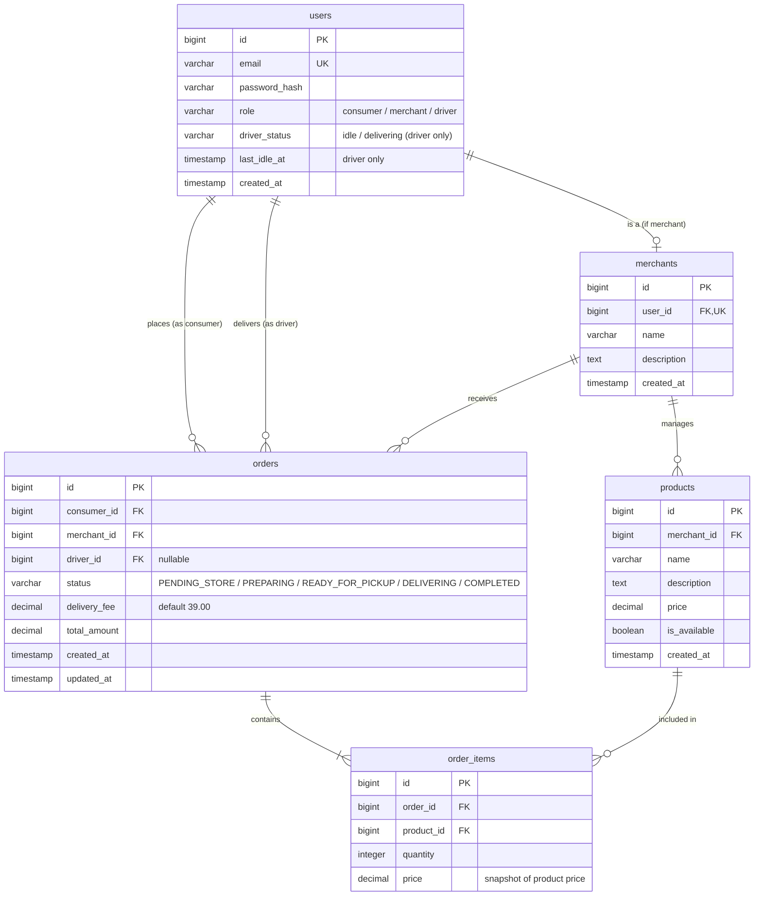

# Data Model Design - 外送系統 (Delivery System)

## 1. Entity Relationship Diagram (ERD)
以下使用 Mermaid ER 圖表示系統的核心實體及其關聯性。

---

## 2. Core Entities & Field Specifications

### 2.1 Entity: `users` (用戶表)
- **描述**：儲存系統所有使用者的登入憑證與身分角色。外送員專有欄位亦儲存於此（用於配單邏輯）。

| 欄位名稱 (Column) | SQL 資料型別 | 鍵值 (Key) | 允許空值 (Null) | 預設值 (Default) | 說明 / 約束條件 |
| :--- | :--- | :---: | :---: | :---: | :--- |
| `id` | `BIGINT` | PK | 否 | Auto Inc | 用戶唯一識別碼 |
| `email` | `VARCHAR(255)` | UK | 否 | 無 | 電子信箱（登入帳號） |
| `password_hash` | `VARCHAR(255)` | | 否 | 無 | Bcrypt 加密雜湊值 |
| `role` | `VARCHAR(20)` | | 否 | 無 | 角色限制：`consumer`, `merchant`, `driver` |
| `driver_status` | `VARCHAR(20)` | | 是 | NULL | 外送員專用狀態：`idle` (空閒), `delivering` (配送中) |
| `last_idle_at` | `TIMESTAMP` | | 是 | NULL | 外送員變更為空閒的起算時間。**指派邏輯：`WHERE role = 'driver' AND driver_status = 'idle' ORDER BY last_idle_at ASC` 取得空閒最長者。** |
| `created_at` | `TIMESTAMP` | | 否 | CURRENT_TIMESTAMP | 帳號創立時間 |

### 2.2 Entity: `merchants` (商家詳情表)
- **描述**：當 `users.role = 'merchant'` 時，此表關聯儲存該店家的公開資訊。

| 欄位名稱 (Column) | SQL 資料型別 | 鍵值 (Key) | 允許空值 (Null) | 預設值 (Default) | 說明 / 約束條件 |
| :--- | :--- | :---: | :---: | :---: | :--- |
| `id` | `BIGINT` | PK | 否 | Auto Inc | 商家唯一識別碼 |
| `user_id` | `BIGINT` | FK, UK | 否 | 無 | 外鍵關聯 `users.id`，一對一關係 |
| `name` | `VARCHAR(100)` | | 否 | 無 | 商家名稱 |
| `description` | `TEXT` | | 是 | NULL | 商家簡介描述 |
| `created_at` | `TIMESTAMP` | | 否 | CURRENT_TIMESTAMP | 商家創立時間 |

### 2.3 Entity: `products` (餐點商品表)
- **描述**：商家所管理的菜單餐點項目。

| 欄位名稱 (Column) | SQL 資料型別 | 鍵值 (Key) | 允許空值 (Null) | 預設值 (Default) | 說明 / 約束條件 |
| :--- | :--- | :---: | :---: | :---: | :--- |
| `id` | `BIGINT` | PK | 否 | Auto Inc | 商品唯一識別碼 |
| `merchant_id` | `BIGINT` | FK | 否 | 無 | 外鍵關聯 `merchants.id` |
| `name` | `VARCHAR(100)` | | 否 | 無 | 餐點名稱 |
| `description` | `TEXT` | | 是 | NULL | 餐點描述（如：成分、辣度） |
| `price` | `DECIMAL(10, 2)`| | 否 | 無 | 餐點單價，必須 `>= 0` |
| `is_available` | `BOOLEAN` | | 否 | TRUE | 是否上架（可用於軟刪除/下架） |
| `created_at` | `TIMESTAMP` | | 否 | CURRENT_TIMESTAMP | 商品新增時間 |

### 2.4 Entity: `orders` (訂單主表)
- **描述**：外送訂單的狀態與金額總覽。限制單筆訂單僅限單一商家餐點，外送費固定為 39 元。

| 欄位名稱 (Column) | SQL 資料型別 | 鍵值 (Key) | 允許空值 (Null) | 預設值 (Default) | 說明 / 約束條件 |
| :--- | :--- | :---: | :---: | :---: | :--- |
| `id` | `BIGINT` | PK | 否 | Auto Inc | 訂單唯一識別碼 |
| `consumer_id` | `BIGINT` | FK | 否 | 無 | 外鍵關聯 `users.id` (消費者) |
| `merchant_id` | `BIGINT` | FK | 否 | 無 | 外鍵關聯 `merchants.id` (商家) |
| `driver_id` | `BIGINT` | FK | 是 | NULL | 外鍵關聯 `users.id` (外送員)，指派前為空 |
| `status` | `VARCHAR(50)` | | 否 | 'PENDING_STORE' | 訂單狀態約束（見 ER 圖說明） |
| `delivery_fee` | `DECIMAL(10, 2)`| | 否 | 39.00 | 固定外送費 39.00 元 |
| `total_amount` | `DECIMAL(10, 2)`| | 否 | 無 | 訂單總金額（餐點總價 + 外送費） |
| `created_at` | `TIMESTAMP` | | 否 | CURRENT_TIMESTAMP | 訂單建立時間 |
| `updated_at` | `TIMESTAMP` | | 否 | CURRENT_TIMESTAMP | 訂單更新時間 |

### 2.5 Entity: `order_items` (訂單餐點明細表)
- **描述**：儲存該筆訂單所點選的餐點明細與數量。

| 欄位名稱 (Column) | SQL 資料型別 | 鍵值 (Key) | 允許空值 (Null) | 預設值 (Default) | 說明 / 約束條件 |
| :--- | :--- | :---: | :---: | :---: | :--- |
| `id` | `BIGINT` | PK | 否 | Auto Inc | 明細唯一識別碼 |
| `order_id` | `BIGINT` | FK | 否 | 無 | 外鍵關聯 `orders.id` |
| `product_id` | `BIGINT` | FK | 否 | 無 | 外鍵關聯 `products.id` |
| `quantity` | `INTEGER` | | 否 | 1 | 餐點數量，必須 `> 0` |
| `price` | `DECIMAL(10, 2)`| | 否 | 無 | 下單當時的商品快照單價 |

---

## 3. Data Validation Rules
1. **用戶角色驗證**：`users.role` 必須符合 `['consumer', 'merchant', 'driver']`。
2. **電子信箱驗證**：`users.email` 必須符合標準 Email 格式。
3. **商品價格約束**：`products.price` 必須大於等於 `0`。
4. **訂單餐點數量約束**：`order_items.quantity` 必須大於 `0`。
5. **固定外送費約束**：`orders.delivery_fee` 在建立時必須自動填入 `39.00`。
6. **外送員配單規則**：
   - 只有 `users.role = 'driver'` 且 `driver_status = 'idle'` 的用戶才能被指派訂單。
   - 指派成功後，該外送員的 `driver_status` 應即時更新為 `delivering`。

---

## 4. Index Recommendations
為了應對外送系統高頻率的查詢與派單情境，建議建立以下索引：

| 資料表 (Table) | 索引名稱 (Index Name) | 涵蓋欄位 (Fields) | 索引類型 (Type) | 建立原因 |
| :--- | :--- | :--- | :---: | :--- |
| `users` | `idx_users_email` | `email` | Unique B-Tree | 用於加速用戶登入時的帳號檢索 |
| `users` | `idx_driver_dispatch` | `role`, `driver_status`, `last_idle_at` | B-Tree | **核心派單優化**：加速找出「空閒時間最長」的外送員 |
| `orders` | `idx_orders_status` | `status` | B-Tree | 用於快速篩選待指派 (`READY_FOR_PICKUP`) 的訂單 |
| `orders` | `idx_orders_consumer` | `consumer_id` | B-Tree | 用於加速消費者查詢個人歷史訂單列表 |
| `orders` | `idx_orders_merchant` | `merchant_id` | B-Tree | 用於加速店家查詢店鋪訂單列表 |

---

## 5. Data Lifecycle & Retention
- **軟刪除 (Soft Delete)**：
  - 商品 `products` 刪除時不使用硬刪除，而是將 `is_available` 設為 `FALSE`。避免歷史訂單明細 `order_items` 關聯失效。
- **資料保留政策 (Data Retention)**：
  - 訂單主表 `orders` 與明細表 `order_items` 儲存長期交易紀錄。在 MVP 階段，歷史訂單數據將永久保留於資料庫中，不進行封存或刪除，以便進行後續對帳與營運分析。

---

## 6. Sensitive Data Handling
- **密碼安全**：`users.password_hash` 必須使用 `bcrypt` 進行單向雜湊加密，絕對禁止在資料庫中儲存明文密碼。
- **個資去識別化**：在後端 Log 記錄中，嚴禁輸出密碼欄位。
- **連線字串防護**：PostgreSQL 與 SQLite 資料庫連線字串必須透過環境變數傳入，嚴禁提交至 Git 程式庫中。

---

## 7. Outstanding Issues / Items to be Confirmed (待確認事項)
- [ ] **外送員上下線機制與空閒時間重設**：外送員如果登出（或下線），其 `driver_status` 應變更為何？當其重新上線時，`last_idle_at` 是否應該重設為重新上線的時間點，以重新排列配單順序？（MVP 預設：上線時重設 `last_idle_at` 為目前時間）。
- [ ] **退單與訂單取消機制**：消費者送出訂單後是否允許取消？店家接單後若發現材料不足是否能取消訂單？（MVP 預設：暫不提供消費者或店家主動取消訂單之功能，流程一旦啟動即須跑完）。
